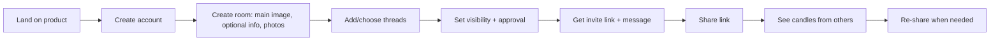
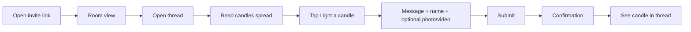
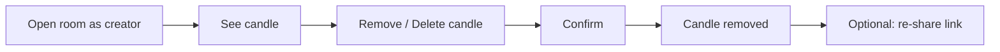

# UX Design Specification – Afterlight

**Author:** Finkel
**Date:** 2026-03-06

**Document purpose:** This is an **instructional base for designers and developers**, not the final pixel-level design. It defines direction, principles, palette, patterns, and copy so that high-fidelity mockups and implementation can be created from it. Treat it as the single source of truth for intent; the “final” design is what gets built or produced in design tools from this spec.

---

<!-- UX design content will be appended sequentially through collaborative workflow steps -->

## Executive Summary

### Project Vision

Afterlight is a shared memorial web app where families and friends create "rooms" for someone who has died and add memories as "candles" (text required; optional photo or video) inside themed threads. The owner can set a main image of the person, optional details (e.g. first/last name, dates, places), and add photos and images to the room; contributors can attach a photo or video to their candle. The product vision is a calm, emotionally safe "home for memories" that supports ongoing shared remembrance over time. The ritual-shaped model (rooms → threads → candles) and privacy-first, non-exploitative stance differentiate it from static tribute pages and ad-driven or noisy alternatives. The desired "aha" moment is when the organizer sees the first candle from someone else and feels the space is working as a shared home.

### Target Users

- **Family Organizer (primary):** Creates the room (main image of the person, optional details such as first/last name, dates of birth and passing, places of birth and death, and additional photos/images—all optional), sets visibility (public or link-only) and optional approval for new candles, obtains the invite link and copyable message, and moderates (remove candle/thread). Wants minimal setup, confidence the space will last, and to see others contribute. Success = first non-creator candle and ability to re-share around anniversaries.
- **Contributor (primary):** Visits via invite link, sees room intro (main image, optional details) and thread list, reads candles, and adds candles (text required; optional photo or video; name or "Someone"). Wants low friction, reassurance that short or anonymous contributions are valid, and the option to return later (e.g. anniversaries).

### Key Design Challenges

- **Emotional safety and cognitive load:** Grief-sensitive tone, pacing, and UX; no pressure or gamification; reassurance that short or anonymous contributions are enough.
- **Ritual-shaped IA:** Rooms → threads → candles must be clear and understandable without feeling gimmicky; first-time and less tech-savvy users need clear wayfinding.
- **Contributor friction:** Minimize steps from link to "Light a candle" to confirmation; gentle copy and optional name/guest so contributors don't hesitate.
- **Moderation without heaviness:** Organizer controls (remove candle/thread, optional approval) must be available but unobtrusive so the space feels like a memorial first.
- **Mobile-first and accessibility:** Touch targets, readability, performance; WCAG 2.1 AA for core flows (room view, thread view, light a candle, room creation, moderation).

### Design Opportunities

- **"Light a candle" as hero action:** Single clear CTA from room and thread; gentle, permission-giving copy; simple form (text first; optional photo or video attachment).
- **Room and thread as calm hierarchy:** Room as "home" (main image of the person, optional details e.g. name/dates/places, owner-added photos); threads as themed places; subtle activity cues without engagement metrics.
- **Candles spread, not aggregated:** Candles are shown individually (spread), not as a single aggregated count. Each candle displays the name of the person who lit it and, when provided, the sentence or message they wrote. Thread view is a list of individual candles (name + message per candle), with pagination/lazy-load as needed.
- **Trust and clarity:** Plain-language visibility and approval settings; invite link and copyable message in one place for re-sharing.
- **Return visits:** Same URL, recognizable room, optional gentle cues that the space is still here for anniversaries and revisits.

## Core User Experience

### Defining Experience

The core experience is defined by one primary action: **Light a candle**. Contributors add a memory (text required; optional photo or video) to a themed thread within a room. For the Family Organizer, the parallel critical flow is **create room → get invite link → share** so others can visit and contribute. The product delivers value when lighting a candle is obvious, low-friction, and emotionally safe—supported by a clear hierarchy (room as home, threads as themes, candles as contributions) and no unnecessary steps or pressure.

### Platform Strategy

- **Web-first, mobile-friendly:** Primary access is via invite link on phone or desktop. All core flows (room view, thread view, light a candle, room creation, moderation) must work from ~320px to desktop.
- **Touch and pointer:** Touch targets and readability prioritized for grief-sensitive use on phones; keyboard and mouse fully supported for accessibility and desktop.
- **No native app or offline for MVP:** Connectivity assumed; progressive enhancement where feasible (e.g. form submit without JS or graceful degradation).

### Effortless Interactions

- **Land on room:** Open link → immediately see who the room is for, a short line, and the list of threads (with subtle candle counts). No signup or login required to view.
- **Light a candle:** One clear CTA from room and from each thread; gentle, permission-giving copy; simple form (text first; optional photo or video; name or "Someone"); minimal steps to submit and see confirmation.
- **Create and share (organizer):** Create room with main image, optional details (name, dates, places), optional photos/images, and starter threads → receive invite link and copyable message in one place; re-share same link anytime.

### Critical Success Moments

- **Organizer:** Sees the first candle from someone other than themselves → realizes the space is working as a shared home.
- **Contributor:** Submits a candle → sees clear confirmation ("Thank you. Your candle is now part of this thread") and their candle in the thread; feels they did something meaningful without it being a big production.
- **Return visit:** Same URL, recognizable room, space still available for anniversaries or when thinking of the person—no re-onboarding, no clutter.

### Experience Principles

- **One hero action:** "Light a candle" is the primary CTA; room and thread structure exist to make this action discoverable and meaningful.
- **Calm and minimal:** No gamification, counts, or engagement prompts; short or anonymous contributions are explicitly valid; tone is grief-sensitive.
- **Ritual clarity:** Room → threads → candles is the mental model; navigation and hierarchy make this obvious without explaining the metaphor.
- **Trust and control:** Visibility (link-only vs public) and approval settings in plain language; invite link and copyable message in one place so organizers can re-share with confidence.

## Desired Emotional Response

### Primary Emotional Goals

- **Emotionally safe and held:** Users should feel the product is a calm, respectful place—no pressure, no judgment. The space supports grief rather than adding cognitive or emotional load.
- **That what they shared was enough:** Contributors should feel their candle (short, anonymous, or long) is valid and welcome. Copy and flow reinforce that there is no "right" way to contribute.
- **The space is working (organizer):** When others add candles, the organizer should feel relief and quiet satisfaction that the memorial is a real shared home, not a one-off page.

### Emotional Journey Mapping

- **First discovery (organizer):** Tired, sometimes skeptical—hoping something will be simple and lasting. Onboarding should reduce doubt and effort so they feel "I can do this."
- **First discovery (contributor):** Lands via link; may feel unsure what to write or whether their note is "enough." Room and thread intro plus gentle "Light a candle" copy should build permission and reduce hesitation.
- **During core action (light a candle):** Calm focus—simple form, reassurance that short or anonymous is fine; no sense of being on display or performing.
- **After contributing:** Brief confirmation and seeing their candle in the thread → "I did something meaningful without it being a big production"; included in shared remembrance.
- **When something goes wrong:** Moderation (remove candle) should feel like restoring safety, not punitive. Errors or limits (e.g. upload) should be explained simply, without blame.
- **Return visit:** Same room, same URL—familiar and still available; "this is still here for me" without re-onboarding or clutter.

### Micro-Emotions

- **Confidence over confusion:** Clear hierarchy (room → threads → candles) and one obvious CTA ("Light a candle") so users know where they are and what to do.
- **Trust over skepticism:** No ads, no selling of data, plain-language privacy and control; invite link and approval settings in the open so organizers feel in control.
- **Permission over anxiety:** Explicit reassurance that short or anonymous contributions are enough; no character minimums or "engagement" pressure.
- **Quiet belonging over isolation:** Seeing others' candles and adding one's own should feel like being part of a shared remembrance, not performing for an audience.
- **Accomplishment without pressure:** Contributor completes a small, meaningful act; organizer sees the space being used—satisfaction without gamification or hype.

### Design Implications

- **Calm and safe:** Soft palette, generous spacing, no auto-play or aggressive motion; copy is warm, concise, and permission-giving (e.g. "There's no right way… Whatever you share is enough").
- **Low pressure:** No counts, streaks, or "engagement" prompts; optional name/"Someone"; no mandatory signup to contribute.
- **Trust and control:** Visibility and approval explained in plain language; invite link and copyable message easy to find and re-share; moderation (remove candle/thread) available but unobtrusive.
- **Clarity and inclusion:** One hero CTA; confirmation message that names the outcome ("Your candle is now part of this thread"); room and thread structure make "where I am" and "what I can do" obvious.

### Emotional Design Principles

- **Safety first:** Tone, pacing, and UI minimize stress and cognitive load; the product never feels exploitative or noisy.
- **Permission over prescription:** Reassure that any contribution is valid; support short, anonymous, or longer candles equally.
- **Quiet connection:** Design for shared remembrance and return visits (e.g. anniversaries) without turning the space into a feed or social stage.
- **Trust through transparency:** Clear control over visibility and approval; no dark patterns; invite and re-share flows support organizer confidence.

## UX Pattern Analysis & Inspiration

### Inspiring Products Analysis

- **Invite-link, low-friction contribution (e.g. shared forms, docs):** Open link → see context → contribute with minimal or no account. **Lesson:** Link-first access, optional name/guest, copyable invite message support organizer re-share and contributor ease.
- **Calm, focused writing (e.g. journaling/reflection apps):** Soft visuals, no feeds, one primary action. **Lesson:** Single hero CTA ("Light a candle"), gentle copy, no gamification or engagement metrics.
- **Themed structure without feeds (e.g. topic-based forums/boards):** Clear hierarchy of place → topic → entry. **Lesson:** Room → threads → candles as the core IA and mental model; wayfinding without feed mechanics.
- **Trust and control (e.g. link-only sharing, clear visibility):** Users see who can access and how. **Lesson:** Plain-language visibility (link-only vs public) and approval settings; invite link and copyable message in one place.

### Transferable UX Patterns

- **Navigation:** One-level-down from room (thread list with optional count per thread) and one-level into thread (candles spread: each candle shown with author name and message). No aggregation that hides individual candles; thread view = list of individual candles (name + sentence each), with pagination/lazy-load. "Light a candle" available from room and from within thread.
- **Interaction:** Single primary action per context; optional secondary (e.g. add photo or video) after text; confirmation that states outcome ("Your candle is now part of this thread").
- **Visual:** Soft palette, generous spacing, readable type; no auto-play or aggressive motion; optional candle/light visual metaphor used sparingly to support ritual feel without kitsch.

### Anti-Patterns to Avoid

- **Static one-way pages:** Design for return visits and ongoing contribution; room and threads should feel like a living space, not a single post.
- **Feed or social mechanics:** No likes, counts, streaks, or "engagement" prompts; avoid infinite scroll or algorithm-driven order where it undermines calm.
- **Heavy signup or opaque permanence:** No mandatory account to view or contribute; clarity on retention/export so families don't fear the platform disappearing.
- **Gimmicks or replacement narrative:** No AI avatars, chatbots, or framing that suggests "talking to" the person; focus on shared remembrance among living people.

### Design Inspiration Strategy

- **Adopt:** Link-first access and copyable invite; one hero CTA; room → threads → candles IA; plain-language visibility and approval; confirmation copy that names the outcome; soft, calm visual direction.
- **Adapt:** Themed-thread pattern adapted to memorial context (starter threads at room creation); optional name/guest to balance attribution and low friction.
- **Avoid:** Feeds, gamification, mandatory signup for contribution, opaque "forever" claims, AI/replacement framing; keep ritual metaphor meaningful but not literal or heavy-handed.

## Design System Foundation

### Design System Choice

**Themeable design system** — Use a themeable UI foundation (e.g. utility-first CSS such as Tailwind plus a component set, or a themeable component library such as Chakra UI or MUI) so the product can achieve a calm, soft, grief-appropriate visual language while keeping development speed and consistency. Avoid a fully custom system (too costly for MVP) and a single rigid established system (e.g. default Material) that would fight the desired emotional tone.

### Rationale for Selection

- **Emotional and brand fit:** Calm, soft palette and generous spacing need to be first-class; a themeable system allows custom tokens (color, type, spacing) without building every component from scratch.
- **Speed and team size:** Small team and MVP scope benefit from shared components, accessibility defaults, and documentation; a themeable library delivers that while still allowing strong customization.
- **Accessibility:** WCAG 2.1 AA is required for core flows; choosing a system with solid a11y defaults (focus, labels, contrast) reduces risk and rework.
- **Platform:** Web and mobile-friendly layout and touch targets are easier with a responsive, themeable component set and design tokens.

### Implementation Approach

- **Design tokens:** Define a small set of tokens for color (soft, low-saturation palette), typography (readable, calm type scale), and spacing (generous padding/margins) that reflect the emotional design principles.
- **Component layer:** Use the chosen library's components as a base; override or extend only where needed for tone (e.g. buttons, cards, form inputs) so the UI feels calm and non-gamified.
- **No heavy motion or auto-play:** Use system defaults for transitions sparingly; avoid animations that distract or feel "product-y"; prefer subtle, purposeful feedback (e.g. confirmation after lighting a candle).

### Customization Strategy

- **Adopt:** Responsive grid, form patterns, focus and keyboard behavior, and baseline accessibility from the chosen system.
- **Customize:** Color palette, type scale, border-radius, and shadow to support a soft, memorial-appropriate feel; primary CTA ("Light a candle") and room/thread cards as key custom expressions.
- **Avoid:** Default "tech" or high-contrast aesthetics; any component styling that feels loud, playful, or gamified.

## 2. Defining Core Experience

### 2.1 Defining Experience

The defining experience for Afterlight is **Light a candle**: a contributor adds a memory (text required; optional photo or video) to a themed thread inside a room. This is the one interaction that, if we get it right, makes the product valuable. Users will describe it as "I lit a candle for them" or "I added a memory to their room." Success means the action is obvious, low-friction, and emotionally safe—so contributors don't hesitate and organizers see the space come to life.

### 2.2 User Mental Model

- **How users think about it:** "I'm adding my memory to a shared place for [person]," not "I'm posting on a feed." The room is "for" the person; threads are themes; a candle is "my contribution." Contribution is optional and can be short or anonymous.
- **Expectations:** Simple form, no heavy signup, and reassurance that whatever they write is enough. They may compare to signing a condolence book, leaving a note, or sending a card—small, meaningful, not performative.
- **Confusion risks:** Unclear where to start ("Which thread?"), fear their note isn't "enough," or too many steps before submit. Mitigate with one clear CTA, gentle copy, and optional name/guest.

### 2.3 Success Criteria

- **"This just works":** One visible "Light a candle" from room and from thread; minimal fields (message, then optional name and media); submit and see confirmation without extra steps.
- **Feeling accomplished:** Clear confirmation (e.g. "Thank you. Your candle is now part of this thread") and seeing their candle in the thread; no sense they had to "perform."
- **Feedback:** Inline or brief modal confirmation; candle appears in the list (or "pending" if approval is on). Errors (e.g. required field, upload failure) are explained simply and without blame.
- **Speed:** Submit-to-confirmation within a few seconds for text-only; photo/video upload shows progress and then confirm when done.

### 2.4 Novel UX Patterns

- **Established + ritual frame:** The interaction is a familiar "add a note" form. The novelty is the framing: "Light a candle" + room/thread/candle hierarchy. No new interaction paradigm; optional light education via copy and IA (e.g. "Choose a thread to add your memory").
- **Adopt:** Simple form pattern, optional media, optional name/guest; clear primary button and success state.
- **Unique twist:** Ritual language and single hero CTA; permission-giving copy ("There's no right way… Whatever you share is enough"); optional anonymity so short or hesitant contributions feel valid.

### 2.5 Experience Mechanics

**1. Initiation**

- **Where:** "Light a candle" CTA on the room view (e.g. near thread list or in a persistent spot) and inside each thread (above or below the candle list).
- **Trigger:** Single primary button or link; label is "Light a candle" (or "Add a memory" as secondary if needed). No competing primary actions on that screen.

**2. Interaction**

- **Flow:** User taps CTA → thread chosen (if from room) or thread is implicit (if from thread) → form: message (required), display name or "Someone" (optional), optional photo or video attachment.
- **Controls:** Text area for message; text field or dropdown for name/Someone; optional upload for photo or video. Submit button clearly labeled (e.g. "Light candle" or "Add candle").
- **Response:** On submit, show loading or disabled state; then success path or inline validation/error.

**3. Feedback**

- **Success:** Confirmation message that states the outcome (e.g. "Thank you. Your candle is now part of this thread."). If approval is required: "Your candle has been added and will appear once the room creator approves it."
- **Errors:** Required message missing or upload failed → inline message, no blame; retry or fix and resubmit.

**4. Completion**

- **Done:** User sees confirmation and can navigate back to thread to see their candle in the spread (their name and message shown like the others). No forced next step; optional "Add another" or return to room/thread.
- **Next:** User can leave, browse other threads, or return later; no gamification or "engagement" prompts.

## Visual Design Foundation

### Color System

- **Direction (Bold & Dignified):** **Chosen palette: A. Slate & silver.** Dark slate header (#2d3748 → #1a202c), soft gray accent (#718096, #4a5568), cool white background (#f7fafc, #fff). Calm, understated, dignified. Alternative options (B–D) remain in `ux-design-directions.html` if revisiting. Backgrounds: cool white or very light gray; avoid warm cream for consistency with chosen palette. No neon or high-saturation "product" primaries. Candle flame stays warm (orange/amber) for "lit" metaphor; wax can be neutral gray to match palette.
- **Semantic mapping:** Primary CTA ("Light a candle") uses warm amber or gold; success/confirmation can use a dignified green or the same warm accent; error and warning remain clear and non-alarming. Candle or flame accents can echo the primary warm tone.
- **Backgrounds and surfaces:** Warm, inviting backgrounds (cream, light warm gray, or very subtle amber wash); cards/surfaces with soft shadow or warm border for depth. Candle imagery (icons, subtle illustrations) can use the same warm accent or a restrained gold/amber.
- **Accessibility:** All text and UI meet WCAG 2.1 AA contrast; bolder colors are chosen so foreground/background ratios remain compliant. Focus and hover states stay visible and dignified.

### Typography System

- **Tone:** Readable, calm, and approachable—neither corporate nor playful. Suited to short copy (room intro, thread titles, candle text) and form labels; support for longer candle text where users write more.
- **Hierarchy:** Clear scale for room name/title, thread titles, body/candle content, and secondary/caption text (e.g. author, date). Sufficient size and line height for body and form fields to reduce cognitive load.
- **Type scale:** Establish a modest scale (e.g. 1.125–1.25 ratio) so hierarchy is clear without dramatic jumps. Body text at least 16px equivalent for readability; touch targets and labels legible on mobile.
- **Accessibility:** Sufficient contrast; avoid very thin or decorative fonts for body; support resizing and screen readers (semantic headings, labels).

### Spacing & Layout Foundation

- **Density:** Generous spacing—airy layout, not dense or busy. Supports emotional safety and reduces visual stress; room and thread content breathe.
- **Spacing scale:** Consistent scale (e.g. 4px or 8px base) for padding, margins, and gaps. Generous padding in cards, forms, and between sections (room header, thread list, candle list).
- **Grid and structure:** Simple grid for room view (hero with main image, optional details, owner-added photos, thread list) and thread view (candles spread—each candle one item showing author name, message, and optional photo/video, with pagination/lazy-load). Single-column or limited columns on mobile; room main image and intro as clear "home," threads as list, and within each thread candles displayed individually (name + message + optional media per candle), not aggregated.
- **Touch and targets:** Adequate touch target size (e.g. 44px min) for primary actions and navigation on mobile; comfortable tap areas for "Light a candle" and thread/card entry.

### Accessibility Considerations

- **Contrast:** All text and UI components meet WCAG 2.1 AA contrast requirements; focus and hover states are visible.
- **Keyboard and focus:** Logical focus order; all core flows (room view, thread view, light a candle, room creation, moderation) operable by keyboard; focus indicators clear but not harsh.
- **Labels and semantics:** Form inputs and buttons have visible or programmatic labels; headings and landmarks support screen reader navigation; "Light a candle" and other primary actions are clearly announced.
- **Motion and distraction:** No auto-playing motion or flashing; any transitions are subtle and optional (e.g. reduced motion respected). Avoid animations that feel playful or distracting in a memorial context.

## Design Direction Decision

### Design Directions Explored

Five directions were explored in `ux-design-directions.html` (including the chosen Bold & Dignified), with earlier options reviewed in Party Mode:

- **Bold & Dignified (chosen):** Richer color (warm amber, gold, deep neutrals), dignified candle imagery (icon next to threads and in CTAs), confident hierarchy. Lights up emotions while honoring the person remembered; gravitas and warmth together.
- **Calm Minimal:** Maximum white space, subtle gray, minimal accent; quiet and uncluttered. Supports low cognitive load and one clear CTA.
- **Warm Ritual:** Cream and soft amber undertones; gentle warmth without literal "candle" orange. Signals "this is a special place" without branding grief.
- **Soft Editorial:** Clear typographic hierarchy, optional serif for headings; can feel more magazine-like than memorial if overused.
- **Quiet Cards:** Card-heavy layout, soft shadows, rounded corners; risk of feeling product-like rather than a single holding space.

### Chosen Direction

**Bold & Dignified.** A more expressive visual direction that lights up emotions while honoring the dignity of the person remembered: richer color (warm amber, soft gold, deep accents), deliberate use of candle imagery as a respectful ritual symbol, and confident typography and spacing. The look should feel meaningful and memorable without being loud or playful—gravitas and warmth together.

### Design Rationale (Stakeholder + Party Mode)

- **Emotional resonance:** Bolder color and candle imagery help the space feel like a dedicated place of remembrance; they support the ritual of "lighting a candle" and can deepen connection for visitors and organizers.
- **Dignity first:** Candle imagery is used with restraint and respect—e.g. small candle icon or illustration next to thread titles, subtle flame in the hero CTA, or a single dignified candle motif—not decorative or kitsch. Palette remains warm and rich (amber, gold, deep neutrals, optional deep blue or burgundy for gravitas), not bright or gamified.
- **Candles spread, not aggregated:** In thread view, each candle is shown individually (spread): author name (or "Someone") and the message/sentence they wrote. No aggregation that collapses candles into a single count; the thread is a list of individual candles so visitors see who lit each one and what they said.
- **Hierarchy and clarity:** One hero CTA ("Light a candle") remains; candle visuals reinforce the metaphor rather than compete with it. Reassurance copy and structure stay in place for emotional safety.

### Implementation Approach

- Implement the Bold & Dignified direction using the themeable design system: richer color tokens (warm amber/gold primary, deep accent options, dignified neutrals), confident type scale, generous spacing.
- **Candle imagery:** Include candle visuals in a dignified way—e.g. small candle icon next to each thread in the list, candle or flame accent on or near the primary "Light a candle" button, optional subtle candle illustration in room hero or empty states. Use a consistent, respectful style (e.g. line art or soft illustration); avoid clip-art or cartoonish treatment.
- **Candle display in thread view:** Show candles spread (one per row/card). Each candle displays: (1) an animated candle that looks lit, (2) the name of the person who lit it (or "Someone"), (3) the message or sentence they wrote, (4) optional photo or video attached by the contributor, and (5) a time summary for when the candle was lit ("Lit X years/months/days ago"). Pagination or lazy-load when there are many candles; no aggregation that hides individual contributions.
- Keep "Light a candle" as the single hero CTA; place reassurance copy ("There's no right way…") immediately with the message input. Ensure contrast and accessibility (WCAG 2.1 AA) with the bolder palette.

## User Journey Flows

Critical flows are derived from the PRD: Family Organizer creates room and invites; Contributor visits and lights a candle; Organizer moderates; Contributor (or Organizer) returns. Below are the detailed flows and patterns.

### 1. Family Organizer – Create room and invite

**Goal:** Create a room, add threads, get the invite link and copyable message, and share so others can visit and contribute.

**Entry:** Search or word of mouth → land on product → create account (email + name).

**Flow:** Create account → Create room (see Room details below) → Choose or add threads (starter suggestions available) → Set visibility (public / link-only) and optional “approve new candles” → Receive invite link + copyable message → Share link (email, chat) → Later: see candles from others, re-share link (e.g. around anniversaries).

**Room details (owner, all optional except a way to identify the room):**

- **Main image:** One primary image of the person (hero/main photo for the room).
- **Identifying info (all optional):** First name, last name; date of birth; date of passing. Dates can be entered as **year only**, **month and year**, or **full date**. Place of birth (city / state / country); place of death (city / state / country).
- **Photos and images:** Owner can add additional photos and images to the room (gallery or multiple images beyond the main image).

**Success:** Invite link and copyable message in one place; minimal steps; first candle from someone else = “space is working.”

**Errors:** Validation on required fields; clear message if room creation fails; option to edit room/threads later.

---

### 2. Contributor – Visit and light a candle

**Goal:** Open the room via link, see who it’s for and the threads, read candles, and add a candle (message + optional name + optional photo or video) with minimal friction.

**Entry:** Tap/open invite link (no account required to view).

**Flow:** Open link → Room view (who it’s for, optional details, main image, thread list with candle counts) → Open a thread → See candles spread (name + message + “Lit X ago”; candles may include photo or video) → Tap “Light a candle” → Form: message (required), name or “Someone” (optional), optional **photo or video** attachment → Submit → Confirmation (“Your candle is now part of this thread”) → See their candle in the spread.

**Candle content (contributor):** Text is required. Contributor can optionally attach **one photo or one video** to their candle (in addition to the message).

**Success:** One clear CTA; reassurance copy; minimal fields; immediate confirmation and candle visible in list (with photo/video if attached).

**Errors:** Required message missing → inline validation; submit failure → clear message and retry.

---

### 3. Family Organizer – Moderate (remove candle)

**Goal:** Remove an inappropriate or mistaken candle (or thread) and keep the room safe without support.

**Entry:** Open room (as creator) → Navigate to thread or room view where the candle appears.

**Flow:** View candle → Use “Remove” / “Delete candle” (visible to creator only) → Confirm removal → Candle removed from thread → Optionally re-share invite with a short note.

**Success:** Control is obvious but unobtrusive; confirmation avoids accidental delete; no need to contact support.

**Errors:** If remove fails, show clear message and retry.

---

### 4. Contributor – Return visit / lost link

**Goal:** Return to the room (e.g. anniversary) or find it again after losing the link.

**Flow (return):** Same URL (bookmark or saved link) → Room view (unchanged) → Browse threads and candles or light a new candle. No re-onboarding.

**Flow (lost link):** If link-only room, search won’t find it → Get link again from organizer or family → Open link → Same room view as first time; optional gentle cue that the space is still here.

---

### Journey patterns

- **Navigation:** Room → thread list → thread (candles spread). One level down from room; one level into thread. “Light a candle” available from room and from within thread.
- **Decisions:** Organizer: visibility and approval at room creation; Contributor: which thread (if starting from room), name vs “Someone.” No branching that blocks core success.
- **Feedback:** Confirmation after submit (“Your candle is now part of this thread”); candle visible in list; optional “pending” state when approval is on. Errors inline, no blame.

### Flow optimization principles

- **Minimize steps to value:** Contributor: link → room → thread → Light a candle → message → submit → done. Organizer: account → room → threads → invite link → share.
- **One hero CTA per context:** “Light a candle” is the primary action; no competing primary buttons.
- **Reassurance at the right moment:** Permission-giving copy next to the message field; optional name/“Someone” so short or anonymous contributions feel valid.
- **Graceful errors:** Inline validation; clear retry or fix; no dead ends.
- **Return visits:** Same URL; no re-onboarding; optional subtle “still here” cue for anniversaries.

## Component Strategy

### Design System Components (foundation)

Use the themeable design system for:

- **Layout:** Grid, container, spacing scale (Slate & silver tokens).
- **Forms:** Text input, textarea, label, validation message — for room creation (main image, optional details, photos) and "Light a candle."
- **Buttons:** Primary CTA ("Light a candle" / "Light candle"), secondary (e.g. "Cancel"), destructive ("Remove") — all with Slate palette and a11y.
- **Cards / surfaces:** For room card, thread list container, candle row container; borders and shadows from tokens.
- **Focus and keyboard:** Logical order, visible focus, labels — no custom behavior that breaks a11y.

Customize only tokens (color, type, spacing) and any component overrides needed for the chosen palette and tone.

### Custom Components

**1. Room hero / header**

- **Purpose:** Introduce the room: main image of the person, optional details (first/last name, dates of birth and passing, places of birth and death), and owner-added photos. Establishes context for contributors.
- **Content:** Main image; optional first name, last name; date of birth (year only, month+year, or full date); date of passing (same flexibility); place of birth (city/state/country); place of death (city/state/country); gallery or list of additional photos/images. All fields optional.
- **Actions:** None required; optional "Edit" for creator only (navigates to room settings).
- **States:** Default; loading (skeleton) if room data is loading.
- **Accessibility:** Semantic heading, image alt text, sufficient contrast (Slate & silver).

**2. Thread list item**

- **Purpose:** One thread in the room: theme name and candle count (or count only), link to thread.
- **Content:** Thread title; optional "X candles" or count.
- **Actions:** Tap/click to open thread. Optional candle icon (dignified, from design direction).
- **States:** Default, hover/focus.
- **Accessibility:** Link or button with clear label; count available to screen readers.

**3. Candle row (spread)**

- **Purpose:** One candle in the thread: who lit it, what they wrote, optional photo or video, and when.
- **Content:** Animated lit-candle asset (small), author name (or "Someone"), message text, optional photo or video attachment, "Lit X ago" (years/months/days).
- **Actions:** None for most users; for room creator only, optional "Remove" with confirm.
- **States:** Default; loading (skeleton); optional "pending" when approval is on.
- **Accessibility:** Candle animation optional or reduced for prefers-reduced-motion; name and message in readable order; time summary and media (alt/caption) announced.

**4. Light-a-candle form**

- **Purpose:** Collect message (required), display name or "Someone" (optional), optional photo or video; submit to add candle.
- **Content:** Message textarea, name input or "Someone" option, optional photo or video upload, primary submit ("Light candle"), reassurance copy next to message.
- **Actions:** Submit; cancel/close. Optional "Add photo" / "Add video" after message.
- **States:** Default, loading (submit), validation error (inline), success (confirmation message).
- **Accessibility:** Labels, error association, focus order, keyboard submit; WCAG 2.1 AA.

**5. Invite block (organizer)**

- **Purpose:** Show per-room invite link and copyable invite message in one place.
- **Content:** Short URL or "Copy link" button; copyable message text (e.g. for email/chat).
- **Actions:** Copy link, copy message.
- **States:** Default; "Copied" feedback.
- **Accessibility:** Button labels ("Copy link", "Copy message"); feedback announced.

**6. Moderation control (remove candle)**

- **Purpose:** Let room creator remove a candle (or thread) with confirmation.
- **Content:** "Remove" or "Delete candle" (and optional "Delete thread" where applicable).
- **Actions:** Trigger remove → confirm → remove.
- **States:** Default; confirming; loading.
- **Accessibility:** Destructive action clearly labeled; confirmation dialog focus and escape.

### Component Implementation Strategy

- Build custom components on top of design system tokens (Slate & silver) and use foundation components (buttons, inputs, cards) where they fit.
- Keep one hero CTA per view; reuse the same "Light a candle" entry point from room and thread.
- Reuse candle row for all candles (spread); animate only the lit-candle asset; support optional photo or video in candle row.
- Room hero supports main image, all optional detail fields (with flexible date and place entry), and owner-added photos/images.
- Ensure all custom components support keyboard and screen readers; test focus order and labels.

### Implementation Roadmap

- **Phase 1 – Core:** Room hero (main image, optional details, owner photos), thread list, thread view (candles spread), candle row (with optional photo/video), Light-a-candle form (message + optional photo/video), primary CTA. Required for Organizer create+invite and Contributor visit+light candle.
- **Phase 2 – Organizer:** Invite block (link + copyable message); room create/edit (main image, optional name/dates/places, threads, visibility, approval, additional photos). Supports full organizer journey.
- **Phase 3 – Moderation and polish:** Remove candle (and optional remove thread); confirmation dialogs; optional "pending" state for candles when approval is on; empty states or loading skeletons.

## UX Consistency Patterns

### Button Hierarchy

- **Primary:** One per view. "Light a candle" / "Light candle" is the only primary CTA on room and thread; Slate primary (#4a5568 or equivalent). Use for submit on Light-a-candle form.
- **Secondary:** "Cancel", "Close", "Back" — lower emphasis (outline or text), no competition with primary.
- **Destructive:** "Remove" / "Delete candle" (creator only); clearly labeled, with confirmation before action.
- **Touch targets:** Minimum 44px height/width on mobile; adequate spacing between buttons.

### Feedback Patterns

- **Success:** After lighting a candle: short confirmation ("Your candle is now part of this thread"); candle appears in the spread. Optional brief "Copied" for invite link/message. No auto-dismiss that's too fast to read.
- **Error:** Inline where possible (e.g. under message field); clear, non-blaming copy; path to fix (e.g. "Add a message").
- **Loading:** Disabled primary button or subtle spinner on submit; for photo/video upload, progress or "Uploading…" so users know it's in progress.
- **Validation:** Inline on blur or submit; required message on Light-a-candle form; date/place fields follow room optional-field rules.

### Form Patterns

- **Light-a-candle:** Message (required) first; name or "Someone" next; optional photo or video last. Reassurance copy next to message. Single submit; no multi-step wizard unless needed for complexity.
- **Room create/edit:** Main image; optional fields (first/last name, DOB, date of passing, place of birth, place of death) with flexible inputs (year only, month+year, or full date; city/state/country). All optional. Additional photos/images as gallery or list. Labels and hints clear; no mandatory fields beyond what's needed to create the room.
- **Labels:** Visible and associated (for a11y); placeholder supports but doesn't replace label. Errors associated with inputs.

### Navigation Patterns

- **Room → thread list → thread:** One level down into threads; one level into a thread (candles spread). Breadcrumb or back from thread to room when useful; no deep nesting.
- **Persistent CTA:** "Light a candle" available from room view and from within thread (above or below candle list) so users don't have to go back to find it.
- **No tabs or multi-level nav for MVP:** Flat structure: room, thread list, thread. Moderation (remove) in context on the candle row for creator.

### Additional Patterns

- **Empty states:** Thread with no candles yet: gentle prompt to be the first to light a candle; same CTA. Room with no threads: organizer prompt to add threads (if creator).
- **Loading states:** Room and thread use skeleton or minimal spinner; avoid blank screens. Candle row can skeleton while loading.
- **Modals/overlays:** Light-a-candle can be modal or in-page form; confirmation can be inline or brief modal. Confirmation for "Remove candle" in a modal or dialog with clear Confirm/Cancel.
- **Reduced motion:** Respect prefers-reduced-motion for candle flame animation; no essential info in motion alone.

## Responsive Design & Accessibility

### Responsive Strategy

- **Mobile-first:** Primary use is via invite link on phones. Room view, thread list, thread view (candles spread), and Light-a-candle form must work from ~320px up. Single column; room hero (main image + optional details) and thread list stack vertically; candle rows full width; one primary CTA always visible.
- **Tablet:** Same layout as mobile with more comfortable spacing; no separate tablet layout required for MVP. Touch targets and tap areas remain at least 44px.
- **Desktop:** Optional use of max-width container for readability; room/thread content can sit in a centered column. No multi-column candle grid for MVP—candles stay in a single list. Extra space used for padding and breathing room, not extra UI.

### Breakpoint Strategy

- **Base (default):** 320px and up (mobile-first). Single column, stacked sections, full-width CTAs.
- **Breakpoint(s):** Optional at 768px or 1024px to increase max-width of content area and/or padding; no structural change to room → thread list → thread. Use relative units (rem, %, min/max-width) so type and spacing scale; avoid fixed px for key layout.
- **Target viewport range:** ~320px to ~1280px (and beyond) without horizontal scroll or clipped content.

### Accessibility Strategy

- **WCAG 2.1 Level AA** for core flows (room view, thread view, light a candle, room creation, moderation). Contrast, focus, labels, and keyboard operability per AA.
- **Contrast:** Slate & silver palette chosen so text and UI meet 4.5:1 (normal text) and 3:1 (large text / UI components). Check primary button and links against background.
- **Keyboard:** All primary actions (open thread, Light a candle, submit, copy link, remove candle, confirm/cancel) operable by keyboard; focus order logical; focus visible (clear focus ring).
- **Screen readers:** Semantic structure (headings, landmarks, list for threads/candles); form labels and errors associated; "Light a candle" and other CTAs announced clearly; candle row content (name, message, "Lit X ago") in readable order. Optional photo/video: alt or short description.
- **Touch targets:** Minimum 44×44px for primary actions and links on touch devices; adequate spacing between tappable areas.
- **Motion:** Candle flame animation optional or reduced when prefers-reduced-motion is set; no essential information conveyed by motion alone.

### Testing Strategy

- **Responsive:** Test room, thread list, thread, and Light-a-candle at 320px, 375px, 768px, 1024px; no horizontal overflow; text readable without zoom.
- **Accessibility:** Run automated a11y checks (e.g. axe, Lighthouse) on key pages; keyboard-only pass through room → thread → light candle → submit; test with one screen reader (e.g. VoiceOver or NVDA) for labels, headings, and flow.
- **Real devices:** Spot-check on at least one iOS and one Android device for touch and layout.

### Implementation Guidelines

- **Responsive:** Prefer rem and % for layout and type; use min/max-width and fluid spacing; ensure images (room main image, owner photos, candle photo/video) scale or constrain so layout doesn't break.
- **Accessibility:** Use semantic HTML (header, main, nav, section, article where appropriate); ensure form inputs have visible labels and error messages linked via aria-describedby or similar; provide skip link(s) if needed for keyboard users; maintain visible focus styles on all interactive elements.
- **Focus:** After submit (light candle) or after "Remove" confirm, move focus to a sensible target (e.g. confirmation message or back to list). Modal/dialog traps focus and returns focus on close.
